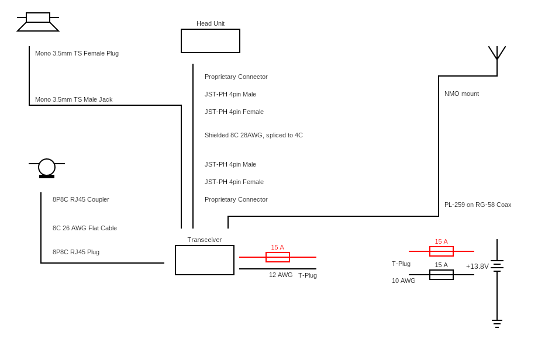

# Radio System
Kenwood Dual-band 2m mobile amateur radio

## Kenwood G707A
mounting screws: M4 x 8 0.7 pitch

## Resources
[Stack Exchange - Shielding and Ground Loops](https://electronics.stackexchange.com/questions/26597/shielding-and-ground-loops)  
[All About Circuits - Why shielded cables should be grounded](https://forum.allaboutcircuits.com/threads/why-we-need-to-connect-shield-of-shielded-cable-to-earth-ground.71926/)  
[Quora - How to ground a shielded cable](https://www.quora.com/Should-a-shielded-cable-ground-both-ends)  
[EDN - Grounding and Shielding](https://www.edn.com/understanding-grounding-shielding-and-guarding-in-high-impedance-applications/)  
